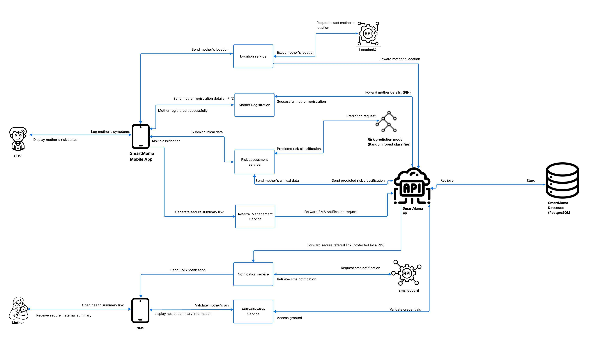

# System Architecture

SmartMama is a layered system:

{ .smartmama-architecture-diagram }

The AI risk classifier is a decision-support component called after structured visit data has been collected.

## Design principle

The API is the enforcement point. The mobile/web UI may hide actions based on role, but the backend must independently enforce authentication, role, assignment and verification rules.

Authentication is separate from authorisation: a user first proves possession of valid credentials, then the backend determines whether that user may perform the requested action. See [Security → Authentication](../security/index.md) and [Security → Authorization](../security/index.md) for the full model and flow.

## Component Overview

| Component | Responsibility |
|---|---|
| Flutter mobile app | CHV-facing field workflows |
| Web dashboards | Supervisor, admin and super-admin workflows |
| FastAPI | API, validation, business rules, authentication and authorisation |
| PostgreSQL | Persistent application data |
| Random Forest | Risk classification decision support |
| IDAnalyzer | Identity/document verification |
| AttachmentScanner | Malware/file scanning before backend processing/storage |
| SMS Leopard | SMS notifications and secure links |
| LocationIQ | Location/geocoding/nearby-location functionality |
| TOTP library | RFC 6238-compatible MFA without a separate MFA provider |

The final implementation should keep integration-specific code behind service modules so that the core domain logic does not depend directly on provider-specific HTTP calls.


## Data Flow

### Maternal monitoring

```text
CHV authentication
      ↓
Mother lookup/registration
      ↓
Consent + identity verification
      ↓
Pregnancy record
      ↓
Household visit
      ↓
Validation
      ↓
Risk classifier
      ↓
Risk classification stored
      ↓
CHV reviews decision-support result
      ↓
Referral where appropriate
      ↓
SMS notification / secure summary
      ↓
Follow-up
```

### Sensitive-data boundary

Identity documents and verification data are sent to the identity-verification provider according to the provider's integration contract. SmartMama should avoid retaining raw biometric material unless there is a documented legal, security and product requirement to do so.

Uploaded application files are scanned before being accepted for further processing. The scanner result must be treated as a security gate, not merely as a UI check.


## Mother Registration Flow

Mother registration is a protected CHV workflow.

1. CHV authenticates.
2. Backend confirms the CHV account is active and identity-verified.
3. CHV starts maternal registration.
4. Required identity and maternal information is collected.
5. Consent is captured through the dedicated consent workflow.
6. Mother identity information/document is sent to IDAnalyzer.
7. Verification result must be `verified` or `failed`.
8. Only a verified mother may proceed to the protected maternal-record workflow.
9. Pregnancy information is created.
10. Location is recorded according to the permitted purpose.
11. Audit activity is recorded.

A mother should never be represented as medically "mother_verified" based only on a selfie. The identity status is **identity verification**, not proof of pregnancy.


## CHV Verification Flow

The CHV onboarding flow has two layers:

1. **Identity verification** using identification information/documents and IDAnalyzer.
2. **Administrative verification of submitted CHV documentation** by a supervisor.

The product assumes that the CHV is an allocated government/community worker for the case study; the platform's responsibility is to verify the submitted identity and require the administrative verification step before granting operational access.

State model:

- `pending`
- `rejected`
- `verified`

Only a verified CHV should be allowed to perform protected CHV operations.

## Risk Assessment Flow

During a household visit, the CHV records structured maternal-health information such as visit date, gestational age, blood pressure, temperature and symptoms.

The backend validates the data and passes the required feature set to the Random Forest classifier.

The classifier returns a **risk classification**. SmartMama stores the result against the relevant visit/pregnancy.

The UI must clearly communicate:

> This is a risk classification used to support decision-making. It is not a medical diagnosis.

Risk output should lead to an appropriate next step according to the configured workflow. A high-risk classification should support escalation/referral but should not be described as confirmation of a disease or complication.

The final clinical decision remains with a qualified healthcare professional.


## External Integrations

SmartMama uses specialised third-party services for functions that should not be reimplemented inside the application.

| Integration | Purpose |
|---|---|
| IDAnalyzer | Identity/document verification |
| SMS Leopard | SMS delivery |
| LocationIQ | Geocoding/location functionality |
| AttachmentScanner | Malware scanning of uploaded files |

Integration calls should be isolated in service/adaptor modules. Provider credentials belong in environment configuration/secrets, not application source.


## Implementation Status

SmartMama has evolved substantially from the original CHV-only prototype.

The following are product decisions established during the project's evolution:

- shared user identity across roles;
- CHV, supervisor, admin and super-admin roles;
- supervisor assignment of CHVs is controlled by admins;
- CHVs cannot access other CHVs' maternal records;
- supervisors cannot access CHVs outside their assignment;
- unverified CHVs cannot perform protected system actions;
- mothers undergo identity verification;
- consent is a distinct workflow/endpoint;
- CHV documentation is reviewed by supervisors;
- IDAnalyzer is the identity-verification provider;
- AttachmentScanner is used for upload malware scanning;
- SMS Leopard handles SMS;
- LocationIQ handles location/geocoding;
- TOTP/RFC 6238 is used for MFA;
- Admin MFA is mandatory while CHV/supervisor MFA is optional;
- Random Forest output is risk classification and decision support, not diagnosis.

Implementation-specific endpoint paths, model fields and configuration names must be updated from the live code before release.
